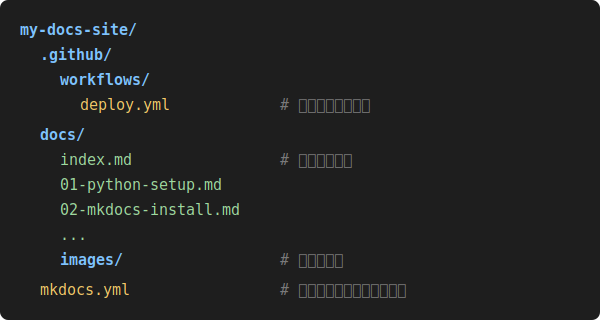

# 2. mkdocsのインストールとサイト作成

=== "本文"

    ## 2-1. mkdocsとテーマのインストール

    ```bash
    pip install mkdocs mkdocs-material
    ```

    - `mkdocs` : Markdownから静的サイトを生成するコア機能
    - `mkdocs-material` : 見た目を整える「Material for MkDocs」テーマ（検索機能・目次・ダークモードなどが標準で付く）

    インストールできたか確認:

    ```bash
    mkdocs --version
    ```

    ## 2-2. サイトの雛形を作成する

    サイトを置きたい場所（例: `C:\DOC`）に移動してから実行します。

    ```bash
    cd C:\DOC
    ```

    ```bash
    mkdocs new my-docs-site
    ```

    以下のファイルが自動生成されます。

    

    - `mkdocs.yml` : サイト全体の設定ファイル（タイトル、テーマ、ナビゲーションなど）
    - `docs/index.md` : トップページの内容
    - 増やしたいページは `docs/` フォルダに `.md` ファイルを追加していく

    ## 2-3. テーマと言語、ナビゲーションの設定

    `mkdocs.yml` を編集して、Materialテーマ・日本語化・ページ一覧（ナビゲーション）を設定します。

    ```yaml title="mkdocs.yml"
    site_name: My Docs
    site_url: https://【GitHubユーザー名】.github.io/【リポジトリ名】/
    theme:
      name: material
      language: ja
    nav:
      - ホーム: index.md
      - 1章: 01-xxxx.md
    ```

    - `site_url` : 後でGitHub Pagesに公開するURL（リンクの解決などに使われるので、最初から正しく入れておくと安心）
    - `nav` : 左側に表示されるページの並び順。新しいページを作ったら、ここに追記しないと一覧に出てきません。

    ## 2-4. ビルドして確認

    設定ファイルにエラーがないか、実際にサイトを生成して確認します。

    ```bash
    mkdocs build
    ```

    ```
    INFO    -  Cleaning site directory
    INFO    -  Building documentation to directory: C:\DOC\my-docs-site\site
    INFO    -  Documentation built in 0.84 seconds
    ```

    `site/` フォルダの中にHTMLファイル一式が生成されていればOKです。
    （この `site/` フォルダはビルド結果なので、Gitには含めません。次の章で `.gitignore` に登録します。）

    ## トラブルシューティング

    ??? note "`mkdocs: command not found` と出る"
        `pip install` 後に同じターミナルでPATHが更新されていない場合があります。
        新しいターミナルを開いてから再度試してください。

    ??? note "ビルド時に `nav` のファイルが見つからないエラーが出る"
        `mkdocs.yml` の `nav:` に書いたファイル名と、`docs/` フォルダ内の実際のファイル名（拡張子含む）が
        一致しているか確認してください。大文字・小文字も区別されます。

=== "改定履歴"

    | 更新日 | 更新者 | 更新内容 |
    |---|---|---|
    | 2026-06-20 | 岡洋介 | 初版作成 |
