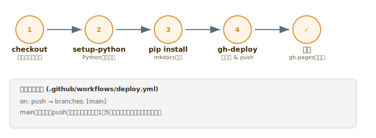

# 4. GitHub Actionsによる自動デプロイ

=== "本文"

    GitHubには **GitHub Actions** という「リポジトリで何かが起きたら、自動で処理を実行する」仕組みがあります。
    これを使い、「`main` ブランチにpushされたら、自動でサイトをビルドして公開する」を実現します。

    ## 4-1. ワークフローの中身

    `.github/workflows/deploy.yml` というファイルを作ります（パスが決まりごとです）。

    ```yaml title=".github/workflows/deploy.yml"
    name: Deploy MkDocs site

    on:
      push:
        branches:
          - main

    permissions:
      contents: write

    jobs:
      deploy:
        runs-on: ubuntu-latest
        steps:
          - uses: actions/checkout@v4
          - uses: actions/setup-python@v5
            with:
              python-version: '3.x'
          - run: pip install mkdocs mkdocs-material
          - run: mkdocs gh-deploy --force
    ```

    実行の流れはこのようになります。

    

    各行の意味：

    | 設定 | 意味 |
    |---|---|
    | `on: push: branches: [main]` | `main` ブランチへのpushをきっかけに起動する |
    | `permissions: contents: write` | Actionsが `gh-pages` ブランチへpushする権限を持たせる |
    | `actions/checkout@v4` | リポジトリの内容をActionsの実行環境に取得する |
    | `actions/setup-python@v5` | Python実行環境を用意する |
    | `pip install mkdocs mkdocs-material` | ローカルと同じツールをインストールする |
    | `mkdocs gh-deploy --force` | サイトをビルドし、`gh-pages` ブランチへ自動push |

    `mkdocs gh-deploy` は、通常の `mkdocs build` に加えて
    「ビルド結果を `gh-pages` という専用ブランチにpushする」までやってくれるコマンドです。

    ## 4-2. ファイルを追加してpush

    ```bash
    mkdir -p .github/workflows
    ```

    上のyamlを `.github/workflows/deploy.yml` として保存したら、コミットしてpushします。

    ```bash
    git add .github/workflows/deploy.yml
    ```

    ```bash
    git commit -m "Add auto deploy workflow"
    ```

    ```bash
    git push
    ```

    ## 4-3. 実行結果を確認する

    ブラウザでリポジトリの **Actions** タブを開くと、実行履歴が見られます。
    コマンドで確認する場合は：

    ```bash
    gh run list --limit 1
    ```

    ```
    in_progress   Initial commit   Deploy MkDocs site   main   push
    ```

    少し待って再度実行し、`completed` / `success` になっていれば成功です。

    ```bash
    gh run list --limit 1 --json status,conclusion
    ```

    ```json
    {"status":"completed","conclusion":"success"}
    ```

    失敗した場合はログを確認できます。

    ```bash
    gh run view --log-failed
    ```

    ## トラブルシューティング

    ??? note "pushしても何も起きない（Actionsタブに表示されない）"
        - ファイルパスが `.github/workflows/deploy.yml` になっているか確認（`github` ではなく `.github`、先頭にドット）
        - YAMLのインデントがスペースで揃っているか確認（タブ文字はエラーになりやすい）
        - push先のブランチ名が `main` になっているか確認（`master` という名前の場合は設定を合わせる）

    ??? note "`Permission denied` でgh-pagesへのpushに失敗する"
        ワークフロー側の `permissions: contents: write` が抜けていないか確認してください。
        また、リポジトリの Settings > Actions > General で
        「Workflow permissions」が `Read and write permissions` になっているかも確認します。

    --8<-- "workflow-scope-warning.md"

=== "改定履歴"

    | 更新日 | 更新者 | 更新内容 |
    |---|---|---|
    | 2026-06-20 | 岡洋介 | 初版作成 |
