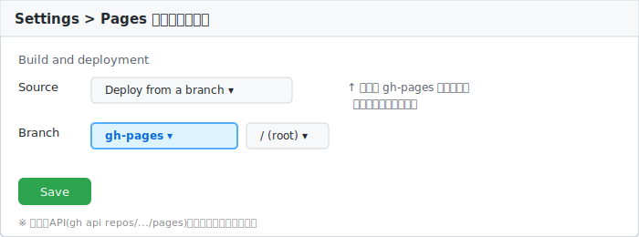

# 5. GitHub Pagesの公開設定

=== "本文"

    前章までで「pushすると `gh-pages` ブランチに自動でビルド結果が送られる」状態になりました。
    最後に、「そのブランチの内容を世界に公開する」スイッチを入れます。

    ## 5-1. ブラウザの画面から設定する場合

    1. リポジトリページを開く → **Settings** タブをクリック
    2. 左メニューの **Pages** をクリック
    3. 「Build and deployment」の **Source** を `Deploy from a branch` にする
    4. **Branch** を `gh-pages` / `/ (root)` にして **Save**

    イメージ図：

    

    保存すると、ページ上部に公開URLが表示されます（数十秒〜数分で反映）。

    ```
    Your site is live at https://ユーザー名.github.io/リポジトリ名/
    ```

    ## 5-2. コマンド（gh api）で設定する場合

    画面操作の代わりに、GitHub CLIのAPIコマンドでも同じ設定ができます。

    ```bash
    gh api repos/【ユーザー名】/【リポジトリ名】/pages -X POST -f "source[branch]=gh-pages" -f "source[path]=/"
    ```

    成功すると、公開URLを含むJSONが返ります。

    ```json
    {
      "html_url": "https://ユーザー名.github.io/リポジトリ名/",
      "source": {"branch": "gh-pages", "path": "/"}
    }
    ```

    ## 5-3. 公開できているか確認する

    ブラウザでURLを直接開くのが一番確実です。コマンドで確認する場合：

    ```bash
    curl -s -o /dev/null -w "%{http_code}\n" https://ユーザー名.github.io/リポジトリ名/
    ```

    `200` が返れば公開成功です（`404` ならまだ反映待ち、または設定ミスです）。

    ## 5-4. 以降の更新方法

    ここまでの仕組みが整えば、以後は次の3行を繰り返すだけです。

    ```bash
    git add -A
    ```

    ```bash
    git commit -m "更新内容のメモ"
    ```

    ```bash
    git push
    ```

    pushした数十秒後には、GitHub Actionsが自動でビルド・公開してくれます。

    ## トラブルシューティング

    ??? note "設定したのに404になる"
        - `gh-pages` ブランチが実際に存在するか確認（最初に1回 `mkdocs gh-deploy` または
          Actionsが成功している必要があります）
        - 反映には数分かかることがあるので、少し待ってから再確認
        - URLの末尾にスラッシュ `/` が必要なリポジトリ名サイト（`https://user.github.io/repo/`）と、
          ユーザーサイト（`https://user.github.io/`）はパスの形が異なるので確認

    ??? note "Settingsに `Pages` メニューが見当たらない"
        プライベートリポジトリの場合、無料プランではGitHub Pagesが使えない場合があります。
        リポジトリを `Public` にすると表示されます。

=== "改定履歴"

    | 更新日 | 更新者 | 更新内容 |
    |---|---|---|
    | 2026-06-20 | 岡洋介 | 初版作成 |
