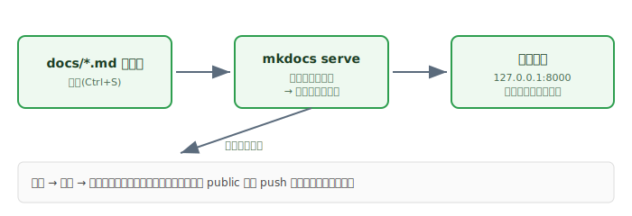

# 6. ローカルでのプレビュー方法

=== "本文"

    毎回GitHubにpushして確認するのは時間がかかります。
    公開前に手元のPCだけでサイトの見た目を確認できると効率的です。

    ## 6-1. プレビューサーバーを起動する

    `mkdocs.yml` がある場所（プロジェクトのルート）で実行します。

    ```bash
    cd my-docs-site
    ```

    ```bash
    mkdocs serve
    ```

    以下のような出力が出て、サーバーが起動します。

    ```
    INFO    -  Building documentation...
    INFO    -  Documentation built in 0.20 seconds
    INFO    -  [hh:mm:ss] Watching paths for changes: 'docs', 'mkdocs.yml'
    INFO    -  [hh:mm:ss] Serving on http://127.0.0.1:8000/
    ```

    ブラウザで `http://127.0.0.1:8000/` を開くとサイトが表示されます。

    !!! tip "site_url を設定していると別パスになる"
        `mkdocs.yml` に `site_url: https://user.github.io/repo/` のようにサブパス付きで
        設定していると、ローカルでも `http://127.0.0.1:8000/repo/` のようなパスで配信されます。
        `http://127.0.0.1:8000/` を開くと自動でそちらへリダイレクトされるので、
        どちらを開いても問題ありません。

    ## 6-2. 編集 → 自動反映の流れ

    

    `docs/` 配下の `.md` ファイルを保存すると、サーバーが自動で変更を検知し、
    ブラウザの表示も自動でリロードされます（ライブリロード）。pushする必要は一切ありません。

    実際の操作：

    1. `mkdocs serve` を実行したまま、エディタで `docs/index.md` などを編集
    2. 保存（Ctrl+S）
    3. ターミナルに `Detected file changes` のようなログが出る
    4. ブラウザが自動更新され、変更が反映される

    ## 6-3. 終了方法

    `mkdocs serve` を実行しているターミナルで `Ctrl + C` を押します。

    バックグラウンドで動かしていて終了させたい場合（PowerShell）：

    ```powershell
    Get-CimInstance Win32_Process -Filter "Name='python.exe'" |
      Where-Object { $_.CommandLine -like '*mkdocs*' } |
      ForEach-Object { Stop-Process -Id $_.ProcessId -Force }
    ```

    ## 6-4. ポートが使われている場合

    8000番ポートが他のアプリで使われていると起動に失敗します。別ポートを指定できます。

    ```bash
    mkdocs serve -a 127.0.0.1:8001
    ```

    ## トラブルシューティング

    ??? note "`Address already in use` と出る"
        8000番ポートが他プロセスで使用中です。上記のように別ポートを指定するか、
        使用中のプロセスを終了してください。

    ??? note "ブラウザを開いても真っ白・404になる"
        - `mkdocs.yml` の `site_url` にサブパスが設定されている場合、ルート `/` ではなく
          そのサブパス（例: `/repo/`）を開く必要があります
        - ターミナルにエラーが出ていないか確認し、`nav:` のファイル名指定が正しいか見直してください

=== "改定履歴"

    | 更新日 | 更新者 | 更新内容 |
    |---|---|---|
    | 2026-06-20 | 岡洋介 | 初版作成 |
